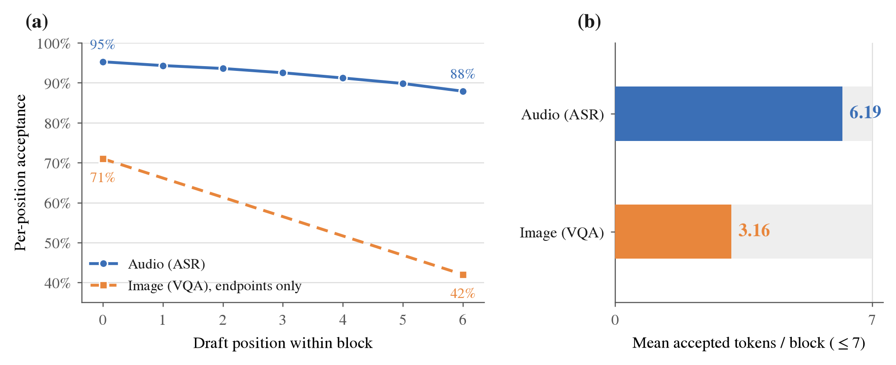

# Qwen3-Omni DSpark Audio Draft Head — Speculative-Decoding Results

Draft (speculative) head for the **Qwen3-Omni-30B-A3B** Thinker, specialized for the
**audio (ASR)** input modality, trained in the [`speculators`](https://github.com/vllm-project/speculators)
DSpark format (directly servable in vLLM, no conversion).

## Setup

| | |
|---|---|
| Verifier | `Qwen3-Omni-30B-A3B-Instruct` (Thinker) |
| Draft format | DSpark (DFlash + Markov head + confidence head) |
| Structure | 5 layers, aux hidden layers `[2,13,24,35,46]`, block size 7, vanilla Markov (rank 256), draft vocab 32k |
| Data | 28,539 LibriSpeech `train-clean-100` utterances, on-policy answers regenerated by the target |
| Training | 3 epochs, online hidden-state extraction (`extract_hidden_states` + `ExampleHiddenStatesConnector` via `/dev/shm`) |
| Transport | 2 GPU extract server + 2 GPU trainer, hidden states streamed (zero disk) |

## Results (validation)

| Metric | Audio (ASR) | Image baseline (VQA) |
|---|---|---|
| **Mean accepted length** | **6.19 / 7** | 3.16 / 7 |
| Acceptance rate | 0.907 | — |
| Full-block accuracy | 0.922 | — |
| Per-position accept (pos0→pos6) | **0.953 → 0.879** | 0.71 → 0.42 |
| Val loss / CE / TV | 0.178 / 0.181 / 0.043 | — |
| Confidence head pred-mean | 0.955 | — |

Acceptance **barely decays across the block** (95.3% → 87.9%), versus 71% → 42% for the
image baseline; mean accepted length is ~2× (6.19 vs 3.16).

Figure: `dspark_audio_head_pub.pdf` (vector) / `.png`. Regenerate with
`python scripts/plot_dspark_audio_head.py`.

## Honest interpretation

The high acceptance is **primarily a property of the task, not of the head**: ASR
transcription output is strongly constrained by the input audio, so the target
distribution is near-deterministic and highly speculation-friendly. This is **not** a
claim that an audio head outperforms an image head in general — ASR is simply an easier
case than open-ended VQA. It is representative of the Qwen3-Omni deployment audio mix,
which the technical report (arXiv 2509.17765) states is ~90% ASR.

## Known caveats

- **~17% of samples dropped in training** (4,866 / 28,539): the HF processor and the
  vLLM forward compute audio mel-frame counts that differ by 1–2 tokens, so those
  samples fail the trainer's prompt-token-ID equality check and are skipped (safely — no
  corruption, just fewer samples; ~23.7k actually trained). Upstream audio-frontend
  parity issue, not a training bug.
- Data is English ASR only (LibriSpeech). Multilingual (FLEURS) and voice-interaction
  (VoiceBench) slices are pending to match the report's 90/10 ASR/understanding mix.
