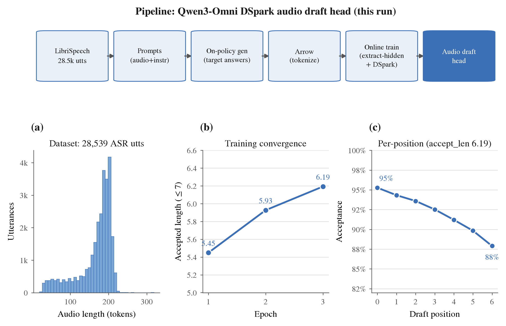

# Qwen3-Omni DSpark Audio Draft Head — Training Profile

Speculative-decoding draft head for the **Qwen3-Omni-30B-A3B** Thinker, specialized for
the **audio (ASR)** input modality, trained in the
[`speculators`](https://github.com/vllm-project/speculators) DSpark format (directly
servable in vLLM, no conversion). This is a self-contained profile of the run — dataset,
pipeline, and training metrics.



Figure: `dspark_audio_profile.pdf` (vector) / `.png`. Regenerate with
`python scripts/plot_dspark_audio_profile.py`.

## Pipeline (built for this run)

```
LibriSpeech            → Prompts          → On-policy gen      → Arrow        → Online train                         → Audio
train-clean-100          (audio + ASR       (target Qwen3-Omni    (tokenize,     extract_hidden_states +               draft
28,539 utterances        instruction)       regenerates the       audio spans    ExampleHiddenStatesConnector          head
                                            answer per utt)       expanded)      via /dev/shm) + DSpark trainer
```

- **On-policy** answers are regenerated by the target itself (skipping this makes the
  loss mask empty → training silently learns nothing).
- **Online hidden-state extraction**: a vLLM extract server (2 GPU) streams the Thinker's
  aux-layer hidden states to the trainer (2 GPU) through a shared-memory KV connector —
  zero disk. Audio spans are expanded by the real forward pass (not the offline placeholder).

## Dataset

| | |
|---|---|
| Source | LibriSpeech `train-clean-100` (English ASR) |
| Utterances | 28,539 |
| Audio length | median 182 tokens (p95 209, max 319) |
| Answer length | median 45 tokens (p95 61) |
| Task instruction | "Transcribe the audio into text." (+ paraphrases) |

Distribution is shown in panel (a). Mix is aligned with the Qwen3-Omni report
(arXiv 2509.17765): audio pretraining is ~90% ASR.

## Configuration

| | |
|---|---|
| Verifier | `Qwen3-Omni-30B-A3B-Instruct` (Thinker) |
| Draft format | DSpark (DFlash + Markov head + confidence head) |
| Structure | 5 layers, aux hidden `[2,13,24,35,46]`, block size 7, vanilla Markov (rank 256), draft vocab 32k |
| Training | 3 epochs, online extraction, `--loss-fn {ce:0.1, tv:0.9}`, confidence head enabled |

## Results

**Training convergence** — mean accepted length, per epoch:

| Epoch | Accepted length (/7) | Accept rate | Val loss | Full-block acc |
|---|---|---|---|---|
| 1 | 5.45 | 0.838 | 0.254 | 0.864 |
| 2 | 5.93 | 0.885 | 0.194 | 0.905 |
| **3** | **6.19** | **0.907** | **0.178** | **0.922** |

**Final per-position acceptance** (panel c): 95.3% → 87.9% across the 7-token block —
barely decays. Confidence head pred-mean 0.955 (CE 0.181, TV 0.043).

## Notes

- The high acceptance is a property of the **ASR task** (transcription output is strongly
  constrained by the input audio → near-deterministic → speculation-friendly),
  representative of the report's ~90%-ASR audio deployment mix.
- **~17% of samples dropped in training** (4,866 / 28,539): the HF processor and the vLLM
  forward compute audio mel-frame counts differing by 1–2 tokens, so those samples fail
  the trainer's prompt-token-ID equality check and are skipped (safely — ~23.7k trained).
  Upstream audio-frontend parity issue, not a training bug.
- English ASR only; multilingual (FLEURS) and voice-interaction (VoiceBench) slices pending.
